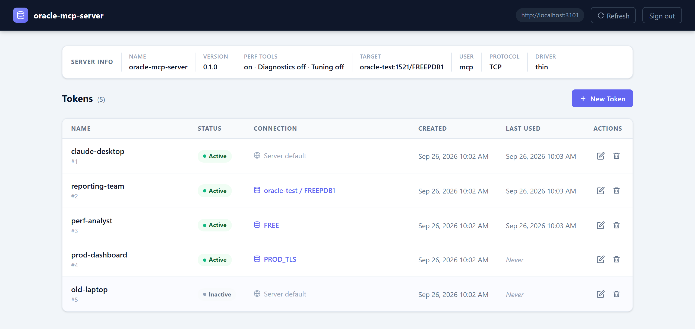
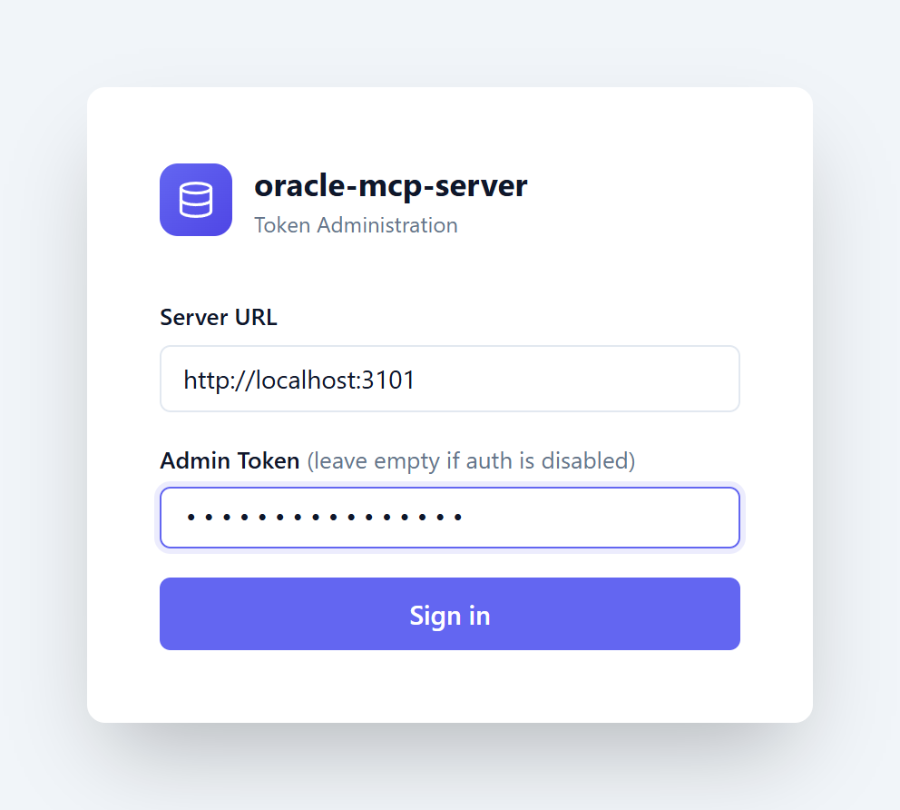
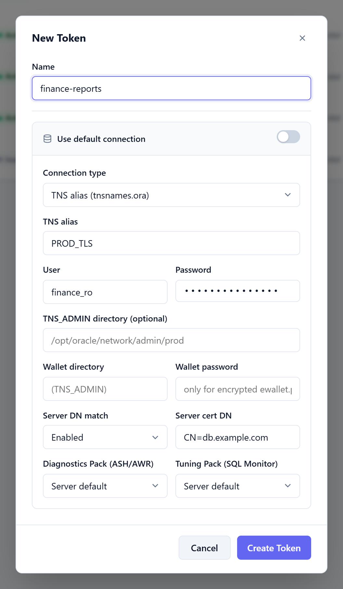
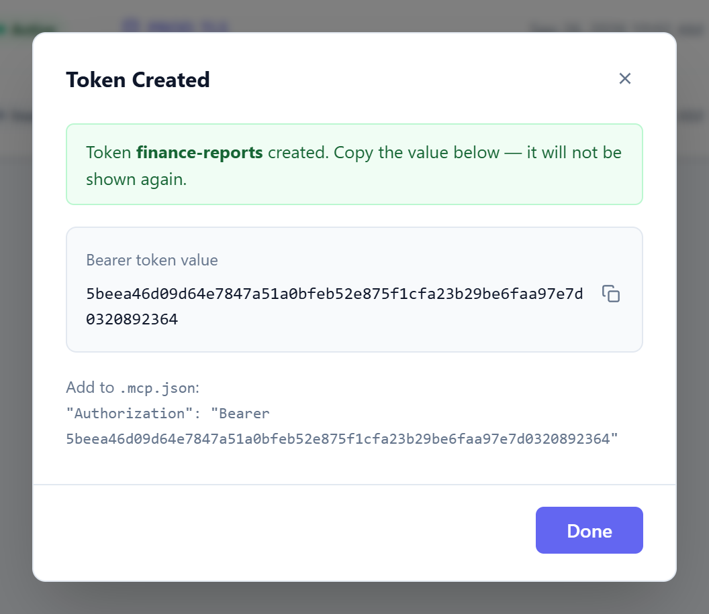
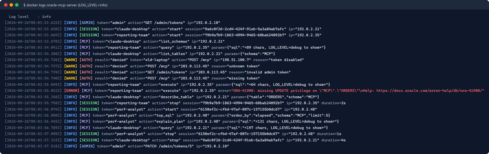
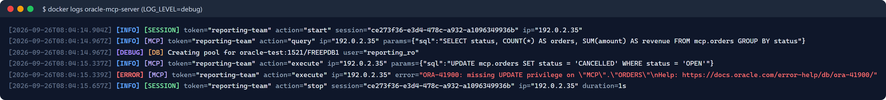

# oracle-mcp-server

[](https://github.com/Tommi2Day/oracle-mcp-server/actions/workflows/ci.yml)
[](https://codecov.io/gh/Tommi2Day/oracle-mcp-server)
[](https://github.com/Tommi2Day/oracle-mcp-server/releases)
[](https://hub.docker.com/r/tommi2day/oracle-mcp-server)
[](LICENSE)

[Model Context Protocol](https://modelcontextprotocol.io) server that gives Claude (and other MCP clients)
access to **Oracle Database** — the Oracle sibling of
[tommi2day/pg-mcp-server](https://github.com/tommi2day/pg-mcp-server).

- **Transports:** `stdio` (Claude Desktop) and Streamable HTTP / HTTPS (remote, multi-user)
- **Connection methods:** classic host/port/service (or SID), TNS alias from `tnsnames.ora`,
  free connect strings (Easy Connect Plus, full descriptors) and **JDBC URLs**
- **Network:** plain SQL*Net (**TCP**) and TLS (**TCPS**) with wallets, server DN matching and private CAs
- **Client config files** (`tnsnames.ora`, `sqlnet.ora`, `ewallet.pem`, `cwallet.sso`) via a volume
  mount (`TNS_ADMIN`) or Kubernetes Secrets/ConfigMaps
- **Driver:** [node-oracledb](https://node-oracledb.readthedocs.io) *thin* mode (pure JavaScript, default)
  or *thick* mode (Oracle Instant Client, optional image variant)
- **Multi-user:** bearer-token auth, per-token database connections, admin UI ([screenshots](#admin-ui)) + REST API,
  secrets encrypted at rest, structured audit log ([example](#logging))

---

## Contents

- [Tools](#tools)
- [Quick start](#quick-start)
- [Connection methods](#connection-methods)
- [TCPS / TLS](#tcps--tls)
- [Oracle client files (TNS_ADMIN)](#oracle-client-files-tns_admin)
- [Thin vs. thick mode](#thin-vs-thick-mode)
- [Configuration reference](#configuration-reference)
- [Session identification](#session-identification)
- [Tokens & per-token connections](#tokens--per-token-connections)
- [Logging](#logging)
- [Kubernetes / Helm](#kubernetes--helm)
- [Claude configuration](#claude-configuration)
- [Development](#development)

---

## Tools

| Tool | Description |
|------|-------------|
| `query` | Read-only `SELECT` / `WITH` query (runs in `SET TRANSACTION READ ONLY`, always rolled back). Bind variables `:1, :2` (array) or `:name` (object). Returns at most `ORA_MAX_ROWS` rows (default 200). |
| `execute` | DML, DDL, `MERGE` or PL/SQL block; committed. Returns rows affected and the `DBMS_OUTPUT` of PL/SQL blocks. |
| `list_tables` | Tables, views and materialized views of a schema (default: current schema). |
| `describe_table` | Columns, Oracle types (`VARCHAR2(50 CHAR)`, `NUMBER(10,2)` …), nullability, defaults, PK and column comments. |
| `list_schemas` | Schemas visible to the user (Oracle-maintained schemas hidden unless `include_system: true`). |
| `test_connection` | Database/PDB name, service, user, server version, driver mode and whether the session uses TCPS. |

Identifiers follow Oracle rules: unquoted names are upper-cased (`emp` → `EMP`), `"MixedCase"` is used verbatim.
A trailing `;` on SQL statements and a trailing SQL*Plus `/` on PL/SQL blocks are stripped automatically.

> The `query` tool rejects anything that is not `SELECT`/`WITH` because DDL would implicitly commit and end
> the read-only transaction. For hard guarantees, connect with a read-only database user.

### Performance analysis

| Tool | Description | Licence |
|------|-------------|---------|
| `explain_plan` | Optimizer plan of a SELECT/WITH/INSERT/UPDATE/DELETE/MERGE (`EXPLAIN PLAN` + `DBMS_XPLAN.DISPLAY`) without executing it; bind variables may stay unbound. | – |
| `sql_plan` | Actual plan of a cached cursor by `sql_id` (`DBMS_XPLAN.DISPLAY_CURSOR`); `format: "ALLSTATS LAST"` for row source statistics. | – |
| `top_sql` | Top statements from `V$SQLAREA` by elapsed, CPU, buffer gets, disk reads, executions or elapsed per execution; filter by schema / text. | – |
| `session_activity` | Active sessions (`V$SESSION`) with sql_id, wait event and blocker, plus top non-idle wait events since startup. | – |
| `table_stats` | Table, index and column optimizer statistics incl. staleness, clustering factor and histograms. | – |
| `ash_top` | Active Session History of the last N minutes grouped by sql_id, event, wait class, session or module. | **Diagnostics Pack** |
| `awr_top_events` | DB time, DB CPU and top wait events between the first and last AWR snapshot of the last N hours. | **Diagnostics Pack** |
| `sql_monitor` | Recent monitored executions (`V$SQL_MONITOR`) or the text report of one `sql_id`. | **Tuning Pack** |

**Licensed features are disabled by default.** Tools that need an Oracle management pack are neither listed to
the client nor executable unless enabled:

| Switch | Default | Scope |
|--------|---------|-------|
| `ORA_PERF_TOOLS` | `true` | `false` hides all performance tools (global) |
| `ORA_DIAGNOSTICS_PACK` | `false` | enables `ash_top`, `awr_top_events` |
| `ORA_TUNING_PACK` | `false` | enables `sql_monitor` (Oracle licenses the Tuning Pack only together with the Diagnostics Pack) |

Tokens can override the pack switches for their connection (`diagnostics_pack` / `tuning_pack`, admin UI or
`admincli.sh add-token … --diagnostics-pack true`), so one server can serve licensed and unlicensed databases.
If the database itself has `CONTROL_MANAGEMENT_PACK_ACCESS` set to `NONE`, the tools say so when they find no data.

> The switches only control this server's tools. The generic `query` tool can still read any view the database
> user is allowed to see — revoke access to `V$ACTIVE_SESSION_HISTORY`, `DBA_HIST_*` and `V$SQL_MONITOR` on the
> database side if pack usage must be prevented technically.

Privileges: the unlicensed tools except `explain_plan` read dynamic performance views. Run
`scripts/sql/grant_perf_privileges.sql <user> [MINIMAL|CATALOG] [diagnostics Y|N] [tuning Y|N]` as SYS — in
`MINIMAL` mode it creates separate roles for the unlicensed tools and each pack, so licensed views are only
reachable where the pack is granted. Errors caused by missing privileges include a hint.
**Full documentation of the tools, privileges and the grant script: [docs/performance.md](docs/performance.md).** In a PDB, `awr_top_events` uses the PDB's own snapshots (`AWR_PDB_AUTOFLUSH_ENABLED=TRUE`) and
otherwise falls back to CDB root snapshots where their statistics are visible.

Internal statements of the performance tools run with `ACTION=mcp-perf:<tool>` and are excluded from `top_sql`
(see [Session identification](#session-identification)).

---

## Quick start

### docker compose (with a local Oracle Free test database)

```bash
cp .env.example .env            # set AUTH_TOKEN (openssl rand -hex 32)
docker compose up -d            # Oracle Free 23ai + MCP server on http://localhost:3000
./scripts/test_token.sh "$AUTH_TOKEN"
```

`examples/tns_admin/` is mounted as `TNS_ADMIN`; its `tnsnames.ora` defines the alias `FREE` for the test database.

### docker run

```bash
docker run -d --name oracle-mcp-server -p 3000:3000 \
  -e AUTH_TOKEN=$(openssl rand -hex 32) \
  -e ORA_CONNECT_STRING='jdbc:oracle:thin:@//db.example.com:1521/ORCLPDB1' \
  -e ORA_USER=app -e ORA_PASSWORD=secret \
  -v "$PWD/tns_admin:/opt/oracle/network/admin:ro" \
  -v oracle-mcp-data:/data \
  tommi2day/oracle-mcp-server
```

or `./scripts/run.sh` (reads `.env`, generates `./auth_token`, mounts `./tns_admin` if present).

### Local (stdio, Claude Desktop)

```bash
npm ci && npm run build
ORA_HOST=localhost ORA_SERVICE_NAME=FREEPDB1 ORA_USER=mcp ORA_PASSWORD=mcp_pw node dist/index.js
```

---

## Connection methods

The default connection is built from `ORA_*` environment variables; each token can override it
(see [per-token connections](#tokens--per-token-connections)). The target is chosen by precedence:

| # | Method | Env var(s) | Token field(s) |
|---|--------|-----------|----------------|
| 1 | Free connect string / JDBC URL | `ORA_CONNECT_STRING` | `connect_string` |
| 2 | TNS alias | `ORA_TNS_ALIAS` (+ `TNS_ADMIN`) | `tns_alias` (+ `tns_admin`) |
| 3 | Host / port / service | `ORA_HOST`, `ORA_PORT` (1521), `ORA_SERVICE_NAME` or `ORA_SID`, `ORA_PROTOCOL` (`tcp`\|`tcps`) | `host`, `port`, `service_name`, `sid`, `protocol` |

Credentials: `ORA_USER` / `ORA_PASSWORD` (or `ORA_PASSWORD_FILE`).

### Accepted connect strings

| Input | Used as |
|-------|---------|
| `db:1521/ORCLPDB1`, `//db:1521/ORCLPDB1` | Easy Connect |
| `tcps://db:2484/ORCLPDB1?ssl_server_dn_match=true` | Easy Connect Plus (parameters passed through) |
| `(DESCRIPTION=(ADDRESS=(PROTOCOL=TCPS)(HOST=db)(PORT=2484))(CONNECT_DATA=(SERVICE_NAME=svc)))` | Connect descriptor |
| `PROD_HIGH` | TNS alias |
| `jdbc:oracle:thin:@//db:1521/ORCLPDB1`, `jdbc:oracle:thin:@db:1521/ORCLPDB1` | → Easy Connect |
| `jdbc:oracle:thin:@db:1521:ORCL` | legacy **SID** syntax → descriptor with `(SID=ORCL)` |
| `jdbc:oracle:thin:@tcps://db:2484/svc` | → Easy Connect Plus (TCPS) |
| `jdbc:oracle:thin:@(DESCRIPTION=…)` | → descriptor |
| `jdbc:oracle:thin:@prod_high?TNS_ADMIN=/opt/oracle/wallets/prod` | → alias, `TNS_ADMIN` used as config/wallet dir |
| `jdbc:oracle:thin:scott/tiger@…` | credentials extracted (for tokens they are moved into the encrypted password field) |

JDBC-only driver properties (`oracle.net.*`, `oracle.jdbc.*`) are ignored with a warning.

---

## TCPS / TLS

TCPS works with every connection method: `ORA_PROTOCOL=tcps`, a `tcps://` connect string or
`(PROTOCOL=TCPS)` in a descriptor/alias.

| Situation | What to provide |
|-----------|-----------------|
| Server certificate from a public CA | nothing — the system CA store is used |
| Server certificate from a **private CA** | CA certificate(s) as `ewallet.pem` in `TNS_ADMIN` (or `wallet_location`), or a PEM bundle via `ORA_TLS_CA_FILE` |
| **Mutual TLS** / Autonomous Database wallet | `ewallet.pem` containing private key + certificates in `TNS_ADMIN` or `ORA_WALLET_LOCATION`; `ORA_WALLET_PASSWORD` if it is encrypted |
| Thick mode | `cwallet.sso` (auto-login wallet) + `sqlnet.ora` `WALLET_LOCATION` in `TNS_ADMIN` |

How `ewallet.pem` is used (thin mode):

- contains a **private key** → passed to the driver as wallet (client certificate + trusted CAs)
- contains **certificates only** → added to the process-wide set of trusted CAs
  (node-oracledb thin cannot load a certificate-only file as wallet)

Server identity checks: host name / SAN matching is on by default (`ORA_SSL_SERVER_DN_MATCH=false` or
token `ssl_server_dn_match: false` to disable), `ORA_SSL_SERVER_CERT_DN` / `(SECURITY=(SSL_SERVER_CERT_DN=…))`
pins the certificate subject.

Converting wallets for thin mode:

```bash
# PKCS#12 wallet (ewallet.p12) → PEM (keeps key and certificates)
openssl pkcs12 -in ewallet.p12 -out ewallet.pem -nodes            # unencrypted
openssl pkcs12 -in ewallet.p12 -out ewallet.pem -passout pass:xyz  # encrypted → ORA_WALLET_PASSWORD=xyz
# Trust-only: just the CA certificate
cp root-ca.crt tns_admin/ewallet.pem
```

---

## Oracle client files (TNS_ADMIN)

In the image `TNS_ADMIN=/opt/oracle/network/admin` (declared as `VOLUME`). Mount your files read-only:

```text
tns_admin/
├── tnsnames.ora     # aliases (thin + thick)
├── sqlnet.ora       # thick mode only (thin mode ignores sqlnet.ora)
├── ewallet.pem      # thin mode wallet or trusted CA certificates
└── cwallet.sso      # thick mode auto-login wallet
```

- **Docker:** `-v ./tns_admin:/opt/oracle/network/admin:ro` (files must be readable by uid 1000)
- **Kubernetes:** Secret and/or ConfigMap, combined into one directory by the Helm chart:

  ```bash
  kubectl -n mcp create secret generic oracle-tns-admin \
    --from-file=tnsnames.ora --from-file=sqlnet.ora --from-file=ewallet.pem
  helm install oracle-mcp ./helm/oracle-mcp-server -n mcp --set tnsAdmin.existingSecret=oracle-tns-admin …
  ```

Different tokens can use different client configurations: mount additional directories (Helm
`tnsAdmin.extraSecrets`) and reference them with the token fields `tns_admin` / `wallet_location`
(thin mode). In thick mode the Oracle Client reads only the global `TNS_ADMIN`.

---

## Thin vs. thick mode

| | thin (default) | thick (`ORA_DRIVER_MODE=thick`) |
|---|---|---|
| Image | `tommi2day/oracle-mcp-server:latest` | `tommi2day/oracle-mcp-server:latest-thick` (built with `--build-arg ORACLE_THICK=true`) |
| Oracle Client | none | Instant Client (basic lite) |
| `tnsnames.ora` | ✅ | ✅ |
| `sqlnet.ora` | ❌ (use `ORA_*` settings) | ✅ |
| Wallet | `ewallet.pem` | `cwallet.sso` / `ewallet.p12` via `sqlnet.ora` |
| Per-token `tns_admin` / wallet | ✅ | ❌ (global `TNS_ADMIN` only) |
| Native network encryption, DB < 12.1 | ❌ | ✅ |

Outside the image set `ORA_CLIENT_LIB_DIR` to the Instant Client directory for thick mode.

---

## Configuration reference

### Server

| Variable | Default | Description |
|----------|---------|-------------|
| `TRANSPORT` | `stdio` (image: `http`) | `stdio` or `http` |
| `PORT` | `3000` | HTTP(S) port |
| `AUTH_TOKEN` | – | Admin bearer token; empty disables auth (dev only) |
| `TOKENS_FILE` | `./tokens.json` (image: `/data/tokens.json`) | Token store |
| `STORE_ENCRYPTION_KEY` | – | Encrypts `password` / `wallet_password` in the token store (AES-256-GCM) |
| `MCP_SERVER_NAME` | `oracle-mcp-server` | Name shown in MCP clients and the admin UI |
| `LOG_LEVEL` | `info` | `debug` \| `info` \| `warn` \| `error` (SQL text only at `debug`) |
| `TLS_ENABLED` | `false` | HTTPS for the MCP endpoint |
| `TLS_CERT_FILE` / `TLS_KEY_FILE` | `/certs/tls.crt` / `/certs/tls.key` | Server certificate (self-signed one is generated if missing) |
| `TLS_CA_FILE` | – | CA for client certificates (enables mTLS on the MCP endpoint) |
| `TLS_SAN` | – | Extra SANs for the generated self-signed certificate |

### Oracle

| Variable | Default | Description |
|----------|---------|-------------|
| `ORA_CONNECT_STRING` | – | Free connect string / JDBC URL |
| `ORA_TNS_ALIAS` | – | Alias from `tnsnames.ora` |
| `ORA_HOST` | `localhost` | Database host |
| `ORA_PORT` | `1521` | Listener port |
| `ORA_SERVICE_NAME` | – | Service name |
| `ORA_SID` | – | SID (instead of service name) |
| `ORA_PROTOCOL` | `tcp` | `tcp` or `tcps` |
| `ORA_USER` / `ORA_PASSWORD` | – | Credentials |
| `ORA_PASSWORD_FILE` | – | Read the password from a file (Docker/K8s secrets) |
| `TNS_ADMIN` | image: `/opt/oracle/network/admin` | Directory with `*.ora` files and wallets |
| `ORA_WALLET_LOCATION` | `TNS_ADMIN` if it has `ewallet.pem` | Wallet directory |
| `ORA_WALLET_PASSWORD` | – | Password of an encrypted `ewallet.pem` |
| `ORA_SSL_SERVER_DN_MATCH` | driver default (`true`) | Verify server host name / DN |
| `ORA_SSL_SERVER_CERT_DN` | – | Expected server certificate DN |
| `ORA_TLS_CA_FILE` | – | Additional trusted CA certificates (PEM bundle) |
| `ORA_DRIVER_MODE` | `thin` | `thin` or `thick` |
| `ORA_CLIENT_LIB_DIR` | image: `/opt/oracle/instantclient` (thick image) | Instant Client directory |
| `ORA_POOL_MAX` | `5` | Max connections per pool |
| `ORA_CONNECT_TIMEOUT` | `10` | Connect timeout in seconds |
| `ORA_MAX_ROWS` | `200` | Row limit of the `query` tool |
| `ORA_PERF_TOOLS` | `true` | Performance analysis tools (`false` hides all of them) |
| `ORA_DIAGNOSTICS_PACK` | `false` | Diagnostics Pack licensed → `ash_top`, `awr_top_events` |
| `ORA_TUNING_PACK` | `false` | Tuning Pack licensed → `sql_monitor` |

---

## Session identification

Every database session used by the server identifies the MCP server and the token, so DBAs can attribute
activity in `V$SESSION`, ASH, AWR, SQL Monitor and the audit trail:

| `V$SESSION` column | Value | Example |
|--------------------|-------|---------|
| `PROGRAM` | `MCP_SERVER_NAME` (thin mode; characters other than `A-Z a-z 0-9 . _ -` become `_`) | `Prod_DB__EU_` |
| `MODULE` | `MCP_SERVER_NAME` | `Prod DB (EU)` |
| `ACTION` | tool name; `mcp-perf:<tool>` while a performance tool runs its own statements | `query`, `mcp-perf:top_sql` |
| `CLIENT_IDENTIFIER` | token name (`admin` for `AUTH_TOKEN`, `anonymous` without auth, `stdio` in stdio mode) | `claude-desktop` |
| `CLIENT_INFO` | server name, version and MCP client IP | `Prod DB (EU) 0.1.0 ip=10.0.0.7` |

The attributes are set on every checkout from the pool (tokens with the same effective connection share
sessions) and travel with the next database call — no extra round trip. Values are cut to Oracle's limits
(MODULE 48, ACTION 32, CLIENT_IDENTIFIER / CLIENT_INFO 64 bytes). An idle pooled session keeps the values of its
last use.

```sql
SELECT sid, program, module, action, client_identifier, client_info
FROM   v$session WHERE module = 'Prod DB (EU)';
-- ASH (Diagnostics Pack): DB time per token
SELECT client_id, COUNT(*) FROM v$active_session_history
WHERE  module = 'Prod DB (EU)' GROUP BY client_id;
```

`CLIENT_IDENTIFIER` also appears in unified auditing (`UNIFIED_AUDIT_TRAIL.CLIENT_IDENTIFIER`) and can drive
`DBMS_MONITOR.CLIENT_ID_TRACE_ENABLE` to trace everything a single token does.

---

## Tokens & per-token connections

Tokens are managed in the admin UI (`/admin`), via the REST API (`/admin/tokens`, see `openapi.json`)
or with `scripts/admincli.sh`. The plaintext token is shown once; only its SHA-256 hash is stored.

```bash
export AUTH_TOKEN=<admin token> MCP_URL=http://localhost:3000
./scripts/admincli.sh add-token reporting --host db.example.com --port 2484 --protocol tcps \
    --service REPORTS --user report_ro --password secret
./scripts/admincli.sh add-token prod --tns-alias PROD_HIGH --user app --password secret
./scripts/admincli.sh add-token legacy --connect-string 'jdbc:oracle:thin:@dbhost:1521:ORCL' \
    --user scott --password tiger
./scripts/admincli.sh set-conn 2 '{"tns_alias":"PROD","tns_admin":"/opt/oracle/wallets/prod","user":"app"}'
```

Connection object fields: `connect_string`, `tns_alias`, `host`, `port`, `service_name`, `sid`, `protocol`,
`user`, `password`, `tns_admin`, `wallet_location`, `wallet_password`, `ssl_server_dn_match`, `ssl_server_cert_dn`,
`diagnostics_pack`, `tuning_pack`.

Merge rules with the default connection:

- a token that sets a target (`connect_string`, `tns_alias` or `host`) never inherits target fields of the default
- `user`/`password` fall back to the default only if the token sets no `user`
- `tns_admin`, wallet and TLS fields fall back individually

Secrets are write-only: the API returns `password_set: true` instead of the password, and a `PATCH` without
`password` keeps the stored one. Tokens with the same effective connection share one connection pool.

### Admin UI

Open `http://<server>:3000/admin`, sign in with the server URL and the `AUTH_TOKEN` value (leave it empty if auth
is disabled). The session is kept in `sessionStorage` and cleared when the browser tab is closed.

**Token list** — server info with the default connection and enabled performance features, then every token with
status, connection (server default, host / service or TNS alias) and last use:



<table>
  <tr>
    <td width="33%" valign="top"><b>Login</b><br></td>
    <td width="33%" valign="top"><b>New token with its own connection</b> — TNS alias over TCPS with server certificate DN pinning; Diagnostics/Tuning Pack per token<br></td>
    <td width="33%" valign="top"><b>Token value is shown only once</b><br></td>
  </tr>
</table>

Editing a token changes its name, active state or connection; passwords are never shown and stay unchanged when
the field is left empty. Deleting a token revokes access immediately.

---

## Logging

All activity goes to stderr (`docker logs oracle-mcp-server`) in the format `[timestamp] [LEVEL] [CATEGORY] …`:
tool calls, MCP session start/stop, rejected logins and admin actions. `LOG_LEVEL` (`debug` / `info` / `warn` /
`error`, default `info`) sets the minimum level.

Real output at the default level `info` — three clients working in parallel (one of them over the TNS alias `FREE`
with the performance tools), an `UPDATE` rejected by the read-only database user of `reporting-team`, and four
rejected logins (disabled token, unknown token, wrong admin token, missing token). SQL text is replaced by its length:



With `LOG_LEVEL=debug` the full SQL text is logged, plus internals such as pool creation:



Line format, all categories and keys, and ready-to-use Filebeat / Logstash configurations:
[docs/logging.md](docs/logging.md).

---

## Kubernetes / Helm

```bash
kubectl create namespace mcp
kubectl -n mcp create secret generic oracle-tns-admin --from-file=tnsnames.ora --from-file=ewallet.pem
kubectl -n mcp create secret generic oracle-credentials --from-literal=password='secret'

helm install oracle-mcp ./helm/oracle-mcp-server -n mcp \
  --set oracle.tnsAlias=PROD_HIGH --set oracle.user=app \
  --set oracle.existingSecret=oracle-credentials \
  --set tnsAdmin.existingSecret=oracle-tns-admin \
  --set auth.token=$(openssl rand -hex 32) \
  --set persistence.enabled=true
```

Key values (see `helm/oracle-mcp-server/values.yaml`):

- `oracle.connectString` / `oracle.tnsAlias` / `oracle.host|port|serviceName|sid|protocol`, `oracle.user`
- `oracle.password` or `oracle.existingSecret` (keys `password`, optional `walletPassword`)
- `oracle.driverMode` (`thick` requires the `-thick` image), `oracle.sslServerDnMatch`, `oracle.sslServerCertDn`, `oracle.tlsCaFile`
- `oracle.perfTools` (default `true`), `oracle.diagnosticsPack` / `oracle.tuningPack` (default `false`, enable only when licensed)
- `tnsAdmin.existingSecret`, `tnsAdmin.existingConfigMap`, `tnsAdmin.files` (inline) → projected read-only
  volume at `tnsAdmin.mountPath` (mode `0440`, readable through `fsGroup: 1000`)
- `tnsAdmin.extraSecrets` → additional wallet/tnsnames directories for per-token connections
- `auth.token` / `auth.existingSecret`, `auth.storeEncryptionKey`, `server.tlsEnabled`, `tls.*`, `persistence.*`

`scripts/helm_install.sh` wraps a typical install.

---

## Claude configuration

Remote (HTTP):

```json
{
  "mcpServers": {
    "oracle": {
      "type": "http",
      "url": "https://oracle-mcp.example.com/mcp",
      "headers": { "Authorization": "Bearer <token>" }
    }
  }
}
```

Local (stdio): see `example.mcp.json`.

---

## Development

```bash
npm ci
npm run build          # tsc → dist/
npm test               # vitest (unit tests, no database needed)
npm run lint
npm run typecheck
./scripts/test.sh      # tests in Docker, no local Node.js needed
docker build -t oracle-mcp-server .                                   # thin image
docker build --build-arg ORACLE_THICK=true -t oracle-mcp-server:thick .  # with Instant Client
```

Source layout: `src/oracle.ts` (connect strings, JDBC parsing, pool attributes, wallets — pure),
`src/lib.ts` (logging, auth, token store, admin API), `src/perf.ts` (performance tools and licence gating),
`src/format.ts` (result formatting), `src/index.ts` (MCP tools, HTTP routing, startup).
Log format: see [docs/logging.md](docs/logging.md). Performance tools: [docs/performance.md](docs/performance.md).

---

## License

[MIT](LICENSE) © Tommi2Day
